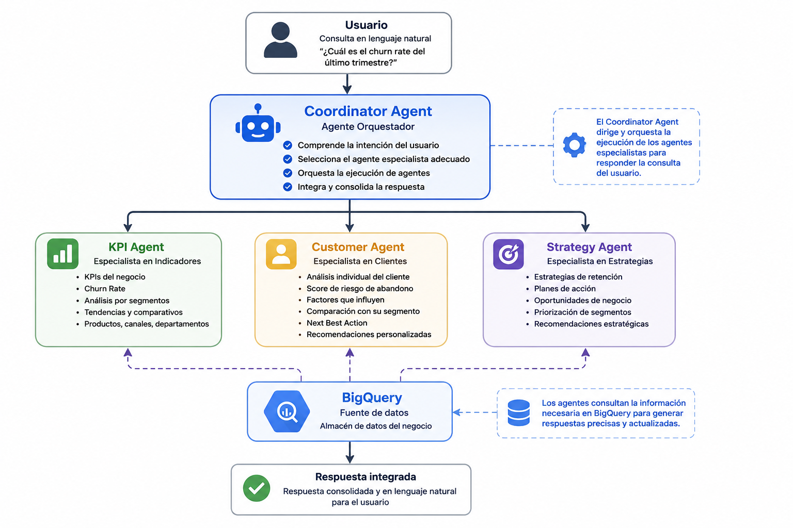
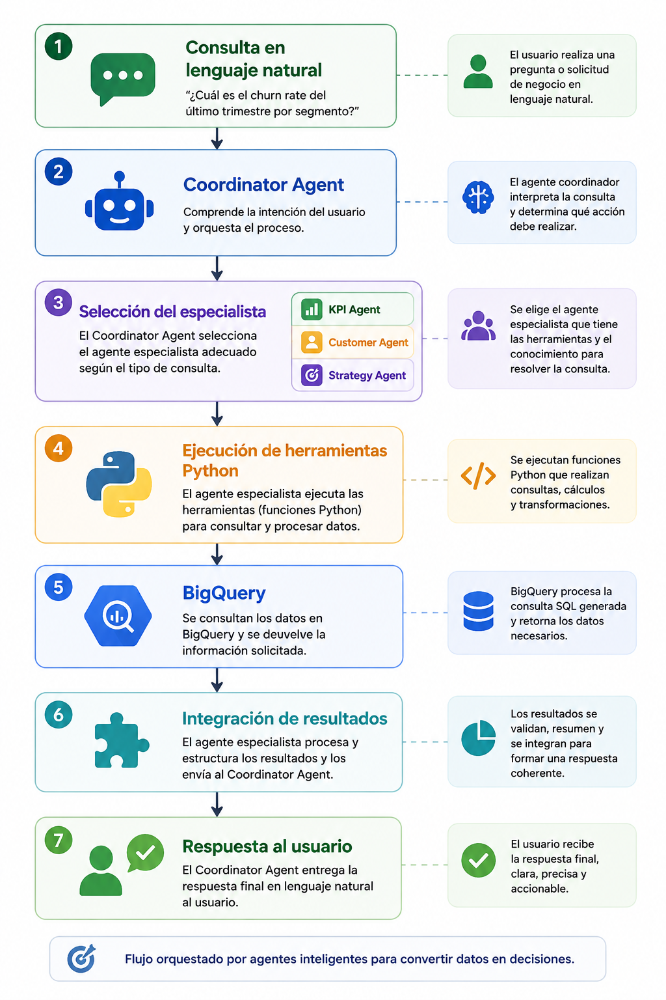
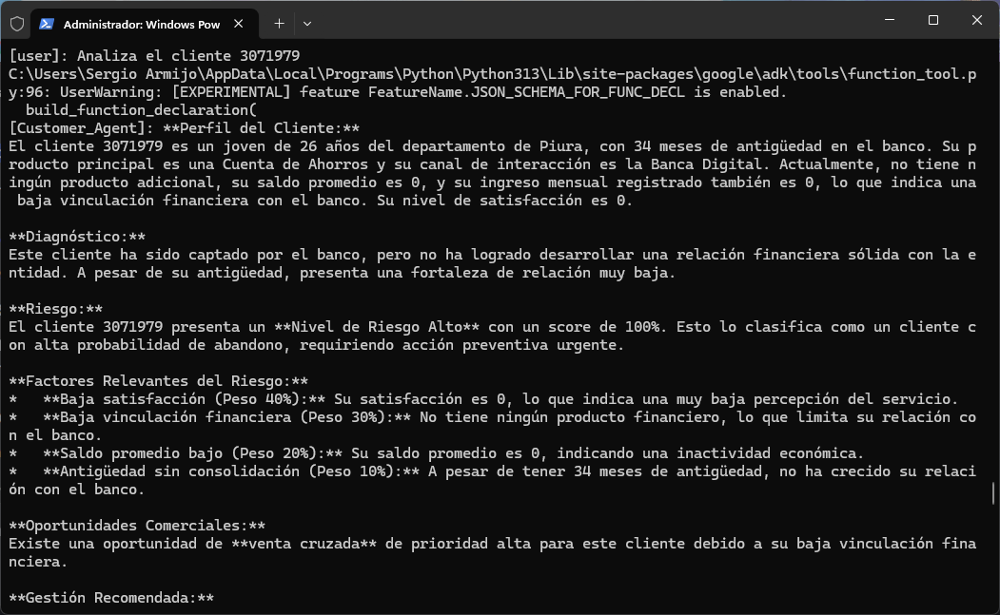
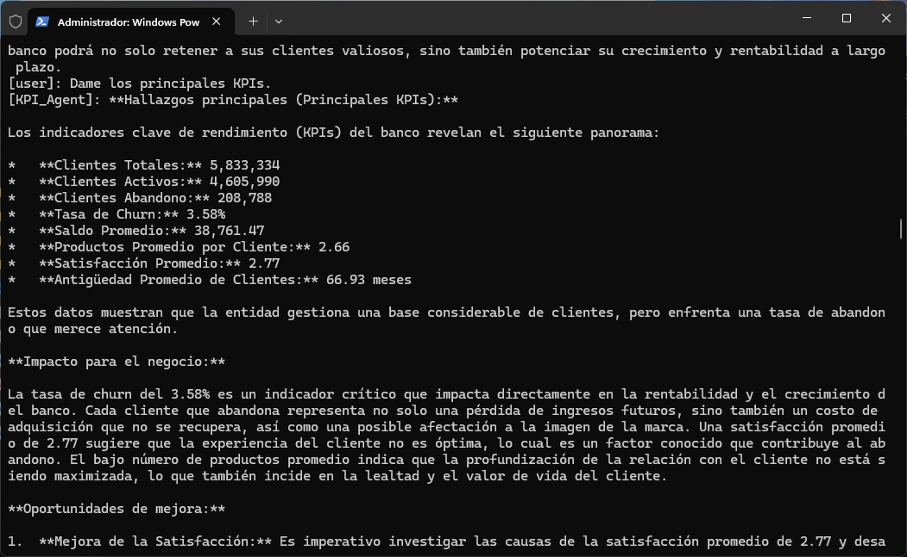
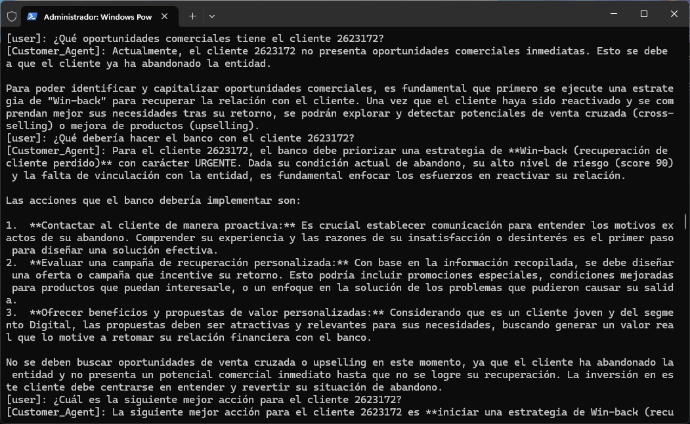
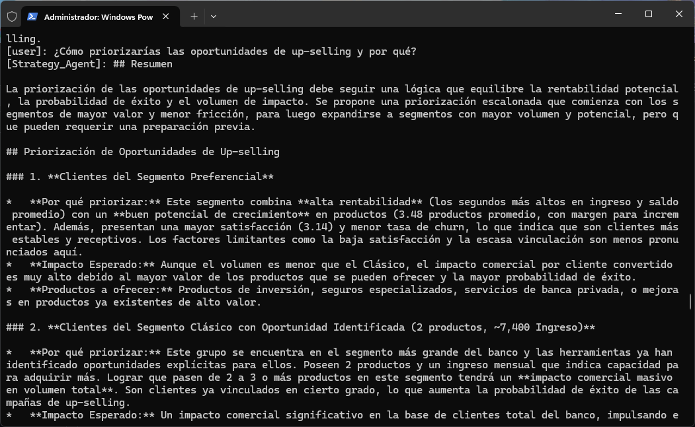
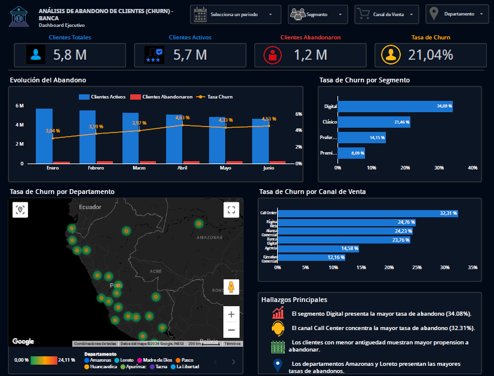
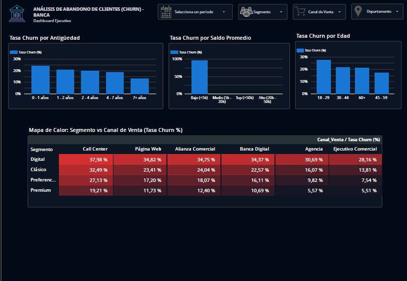
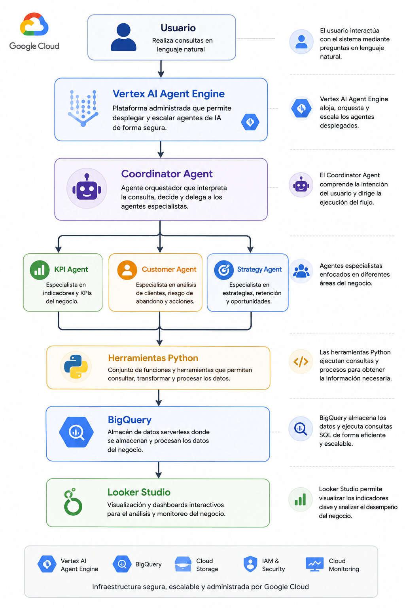

# 🤖 Churn Multi-Agent System con Google ADK

## 📖 Descripción del proyecto

Este proyecto implementa una arquitectura multiagente para el análisis del abandono de clientes (Churn) en una entidad bancaria, desarrollada con Google Agent Development Kit (ADK) y desplegada en Vertex AI Agent Engine.

La solución integra agentes especializados en indicadores de negocio, análisis de clientes y estrategias de retención, coordinados por un Coordinator Agent que interpreta consultas en lenguaje natural y delega automáticamente cada solicitud al especialista adecuado utilizando información almacenada en BigQuery.

---

## 🎯 1. Problema de negocio

Las entidades financieras enfrentan el desafío de identificar oportunamente a los clientes con riesgo de abandono y convertir grandes volúmenes de datos en información útil para la toma de decisiones.

Este proyecto busca responder preguntas de negocio como:

✔️ ¿Cuál es la tasa de abandono del banco?

✔️ ¿Qué segmentos presentan mayor riesgo?

✔️ ¿Qué clientes requieren una gestión inmediata?

✔️ ¿Qué estrategia comercial permitiría reducir el churn?

---

## 🏗️ 2. Arquitectura

La solución sigue una arquitectura Coordinator–Specialist, donde un agente principal orquesta la ejecución de agentes especializados.

---

## ⚙️ 3. Tecnologías utilizadas

🔸 Python

🔸 SQL

🔸 Google Agent Development Kit (ADK)

🔸 Vertex AI Agent Engine

🔸 Gemini 2.5 Flash

🔸 BigQuery

🔸 Google Cloud Storage

🔸 Google Cloud CLI

🔸 Looker Studio

🔸 Visual Studio Code 

---

## 🔄 4. Flujo de la solución

---

## 📈 5. Resultados obtenidos

El sistema permite:

✅ Analizar clientes mediante lenguaje natural.

✅ Calcular indicadores estratégicos del negocio.

✅ Detectar clientes con alto riesgo de abandono.

✅ Recomendar estrategias de retención.

✅ Orquestar automáticamente múltiples agentes especializados.

✅ Ejecutar consultas sobre BigQuery sin escribir SQL.

✅ Desplegar la solución en Vertex AI Agent Engine.

---

## 💬 6. Capturas del agente funcionando

---

## ☁️ 7. Capturas de Vertex AI Agent Engine

> Agregar imágenes de:

Agent Engine

Playground

Despliegue exitoso

Información del Reasoning Engine

---

## 📊 8. Dashboard en Looker Studio

---

## 🌐 9. Arquitectura de Google Cloud

